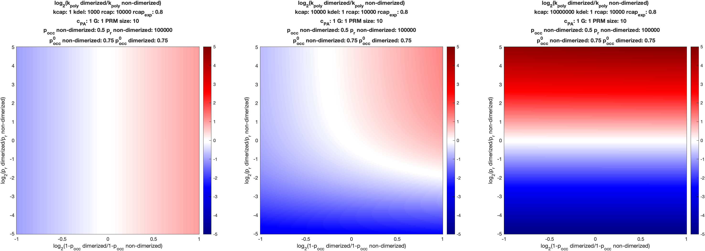
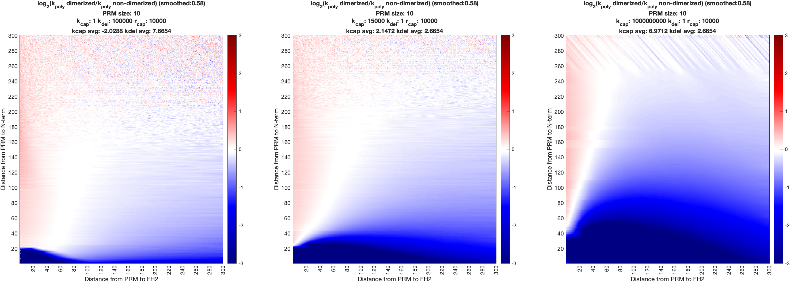

# formin_kinetic_model

Contains code to compute polymerization rates for binding sites (PRMs) on FH1 domains and replicate figures 4 and 5 of Bogue et al., *Formin N-terminal dimerization can impact F-actin assembly via polymer mechanics of the FH1 domain*, publication pending.

## Contents

* ``analysis/``: MATLAB functions used to generate example figures
* ``main/``: MATLAB class definitions and functions involved in computing polymerization rates for formins.
* ``runs/``: where the output figure is saved; includes example files.
* ``workspaces/``: .mat files containing polymer simulation data and colormap configurations required to generate example figures

## Quick Start

#### Set-up

1. Clone this repository to your machine
2. Install MATLAB (The MathWorks, Inc.) if not already installed

#### Generating Example plots

1. Either open the MATLAB GUI or run MATLAB via command-line.
2. Navigate to the ``analysis/`` directory.
3. Run `generateFigs.m`
   runtime ~5min

This will generate 2 plots:

1. Plot 1: polymerization rate ratios (dimer/nondimer) for sweeps across possible probability density and occlusion probability ratios for 3 overall parameter regimes (capture rate-limiting, capture and delivery competing, and delivery rate-limiting). The plots will be saved as kineticHeatmaps.png in the ``runs/`` directory.
   The output should be the following plot:
   
2. Plot 2: polymerization rate ratios (dimer/nondimer) for sweeps across binding site (PRM) location and FH1 domain length (plotted as PRM distance to the C terminal end of the FH1 domain vs PRM distance to the N terminal end of the FH1 domain) for 3 overall parameter regimes (capture rate-limiting, capture and delivery competing, and delivery rate-limiting). The plots will be saved as kpolyHeatmaps.png in the ``runs/`` directory.
   The output should be the following plot:
   

Additional documentation is provided within MATLAB .m files.
